User Documentation
==================

.. note::
    This documentation assumes a basic understanding of the command line, the Linux operating system and Siemens MRI scanner host PCs. Here's a quick (and free!) crash `course <https://www.codecademy.com/learn/learn-the-command-line>`_ on the command line if needed. Instructions on streaming data to the Scanbuddy machine from a scanner are shown on a Siemens XA-30 system.

Overview
^^^^^^^^
Let's start with what Scanbuddy is all about. fMRI is a powerful research and clinical tool that allows us to peer into the brain function of living humans. One of the biggest challenges facing fMRI data quality is subject movement during data acquisition. Even subtle actions, such as swallowing or yawning, can have large impacts on data quality. 

To combat subject motion and optimize data quality, motion-correcting software algorithms can be employed in the post-processing stage, as well as data deletion and imputation methods. However, there are instances of subject motion being severe enough to make the dataset unusable. This is where Scanbuddy comes in! Scanbuddy produces motion plots to be viewed by researchers at the time of data acquisition, appearing on screen at the conclusion of fMRI scans. Individual researchers will determine acceptable motion standards. Seeing motion plots at acquisition can help researchers decide if a scan should be re-acquired. You no longer have to wait until data processing to get an idea of how much your subject has or has not moved.

Scanbuddy also provides an estimate of the Signal-to-Noise Ratio (SNR) with the motion plots to give researchers an idea of overall data quality. Scanbuddy does not save motion plots by default and does not store data on its host machine. Scanbuddy will create a new motion plot and compute a new SNR metric for every fMRI scan acquired. Scanbuddy also supports multi-echo BOLD scans with the assumption that the second echo (TE2) time is the TE of interest. Scanbuddy is containerized with Docker and is available on Github Container Repository.

What You Will Need
^^^^^^^^^^^^^^^^^^
Scanbuddy should be run on a standalone machine (separate from the scanner host PC) that runs Linux and you have sudo privileges. We've used several distributions of Linux in development (ubuntu, debian, asahi) and all have run Scanbuddy successfully. Scanbuddy may work on MacOS and/or Windows, though it has not been tested by the developers. The Scanbuddy machine should have 16 GB of RAM if possible; it may still work with less memory depending on the size of the data being acquired. The machine should be capable of running a web browser and Docker. You will also need a monitor to connect to the machine to display the motion plots.

.. note::
     Take a look at installing Docker on Linux `here <https://docs.docker.com/engine/install/>`_.

Samba Share
^^^^^^^^^^^
Data streaming from the scanner to the Scanbuddy machine should be set up via a Samba share mount. Samba enables the scanner to stream dicom data directly to the Scanbuddy machine so that Scanbuddy can build the motion plots and display them when the scan ends.

Let's get Samba up and running! First thing to do: install Samba:

.. code-block:: shell
    
     sudo apt install samba

Create the directory you want to share over Samba and set ownership to a system account:

.. code-block:: shell

     sudo mkdir -p /data/folder
     sudo chown username:group /data/folder

If you are using SE Linux, you will need to make sure this directory is accessible to Samba:

.. code-block:: shell
    
     sudo semanage fcontext -a -t samba_share_t "/data/folder"
     sudo restorecon -R -v /data/folder

Check ``/var/log/audit/audit.log`` for any Samba denial messages. You may not see any messages until the scanner attempts to mount the drive.

You will also need to create a Samba password. Samba uses its own password database for authentication. The password you choose for Samba may be different from the user's system password. Adding a new Samba user should automatically enable the user, but it's still a good idea to make sure the user is enabled with ``smbpasswd -e username``

.. code-block:: shell

      sudo smbpasswd -a username

Configure Samba
"""""""""""""""
Add the following to the end of ``/etc/samba/smb.conf``

.. code-block:: yaml

  [sharedfolder]
      comment = My Shared Folder
      path = /data/folder
      read only = no
      writable = yes
      browsable = yes
      create mode = 0660
      directory mode = 0770

Save the above file and restart Samba:

.. code-block:: yaml

     sudo service smbd restart

Your Samba share should be up and running now!

Configuring the Plugin
^^^^^^^^^^^^^^^^^^^^^^
We have to tell the scanner which scans should be exported to the Scanbuddy machine and where the scanbuddy machine is. These instructions are for a Siemens XA30 system, though they may be relevant for other systems as well. First things first, make sure you're sitting at your scanner PC!

| 1. Identify the protocol folder with BOLD scans you want to be auto-exported to Scanbuddy. Make the protocol folder editable by clicking on the edit icon.

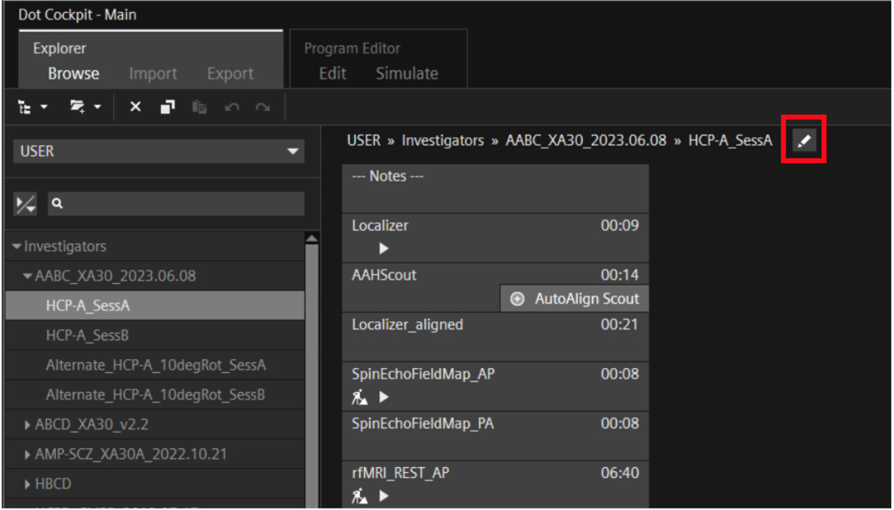

| 2. Once you're in edit mode, click on "Default" and then click on "Default Addins"

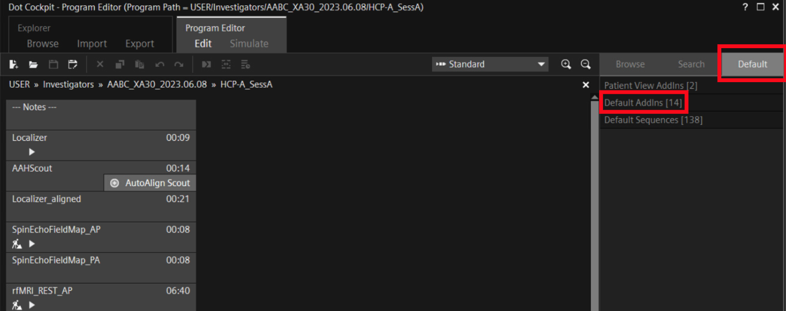

| 3. Find where it says "BOLD" on the list of Addins. Click and drag "BOLD" from the Addin list into the BOLD scan, underneath the scan duration.

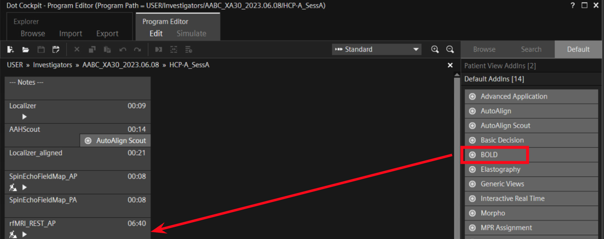

| 4. You should see the BOLD plugin icon on your scan now. Double click on the BOLD icon.

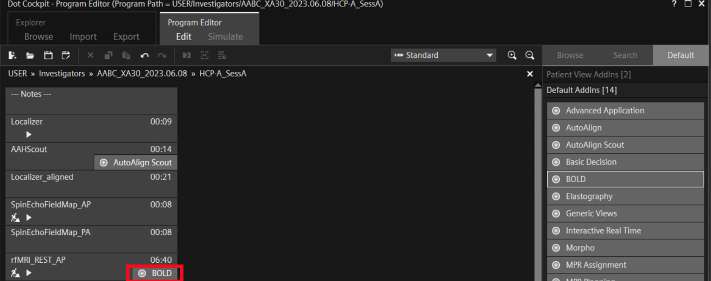

| 5. Make sure you click on the "Preview" tab once you're in the plugin. Now click on the "AddIn Configuration" button on the bottom left.

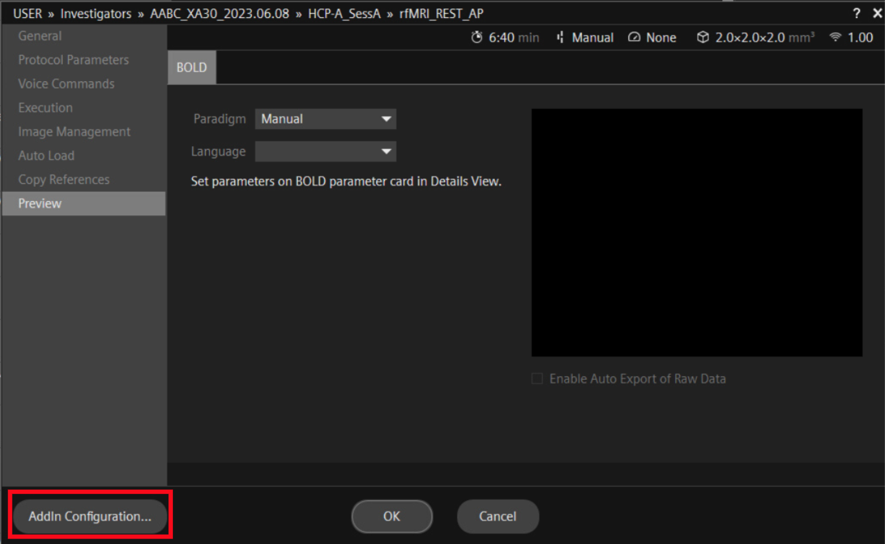

| 6. Check the "Enable Auto Export" box.

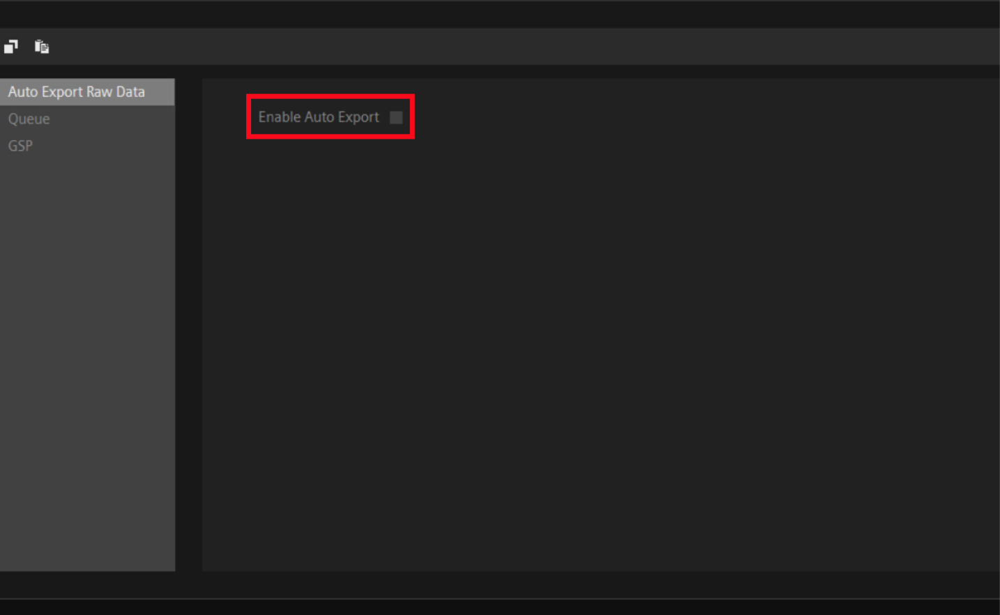

When you click "Enable Auto Export" you should see several more fields appear. The specific information for your system will differ, though the two forward slashes in front of "Target Host" and the one in front of "Target Directory" are important. 

| 7. "Target Host" is the IP address of the machine you're running Scanbuddy on. Consult with your institution's IT group if necessary. "Target Directory" should be the same as the directory you specified in your above Samba Share. "User Name" and "Password" should be admin credentials for the Scanbuddy machine. Otherwise it won't work! Click "Close" and then "Save"

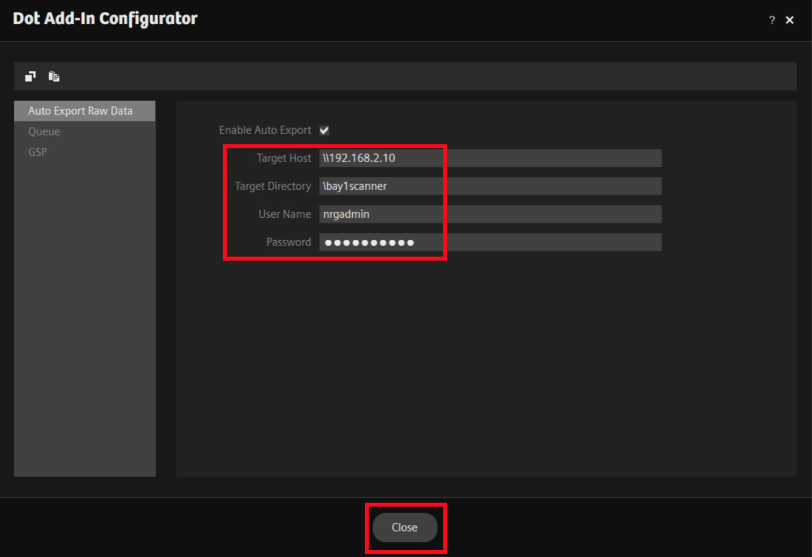

.. note::
        A few things worth mentioning:
        
        | 1. Ensure the Scanbuddy/remote computer is mountable on Siemens PC, but do not mount in Windows Explorer
        | 2. Many users recommend a Domain Name before username, but we found that was not needed
        | 3. Once one scan is configured, the BOLD plugin can be copied and pasted into other scans without the need to repeat these configuration steps for each scan
        | 4. For more advice see `Siemens IDEA board users <https://www.magnetom.net/t/how-to-send-the-real-time-bold-images-to-custom-server-in-order-to-monitor-the-real-time-head-motions/6614/22>`_.

Building the Container Image
^^^^^^^^^^^^^^^^^^^^^^^^^^^^
Scanbuddy is packaged up in a Docker container to abstract away the hassle of installing the specific software it needs. Hurray for Docker! We've built and pushed the Docker image to Github Container Repository so you can run ``docker pull`` to build it on your local (Scanbuddy) machine. Take a look at this page to pull the latest version: `Scanbuddy image <https://github.com/harvard-nrg/scanbuddy/pkgs/container/scanbuddy>`_.

Build the container by running:

.. code-block:: shell

     docker pull ghcr.io/harvard-nrg/scanbuddy:latest

Then verify that it built correctly:

.. code-block:: shell

     docker image ls

You should see the Scanbuddy image listed there (check that it's the correct version).

Redis Container
"""""""""""""""
One feature of Scanbuddy is checking that the head coil is plugged in correctly and communicating correctly with the Scanner PC. We use Redis as a lightweight database to keep track of the head coil status. Run this command to build and run the Redis container:

.. code-block:: shell

     docker run -d --name redis -p 8001:8001 redis/redis-stack:latest

Running Scanbuddy
^^^^^^^^^^^^^^^^^
With the plugin and Samba configured and the container built, we're ready to run Scanbuddy! 

The first thing to do is set a few environment variables inside of your shell for Scanbuddy: ``SCANBUDDY_PASS`` and ``SCANBUDDY_SESSION_KEY``

You can make this whatever you want (I would recommend a string) inside of your ``~/.bashrc`` file:

.. code-block:: shell

     export SCANBUDDY_PASS='iLoveScanbuddy'
     export SCANBUDDY_SESSION_KEY='1234'

.. note::
     Remember to reload your shell environment!

Example Config File
"""""""""""""""""""
We need to ensure that Scanbuddy's browser display is secure in the event it gets added to your institutional network. You shouldn't have to change anything under ``app`` or ``auth`` if you set those environment variables above. Scanbuddy will prompt you for the username and password you provide here when you open the browser display.

In addition to motion plotting and SNR calculation, Scanbuddy will also check your scans for headcoil elements. For example, if the headcoil is not plugged in all the way (e.g. it's missing the HEP element) then Scanbuddy will catch it and display a warning message on the screen. The default message is the one shown below under ``message:``. The coil_elements example shown here is for a 32- channel headcoil, though other types of headcoils may be added.

.. code-block:: yaml

     app:
         title: fMRI Motion
         session_secret:
             env: SCANBUDDY_SESSION_KEY
         auth:
             user: scanbuddy
             pass:
                 env: SCANBUDDY_PASS
     params:
         coil_elements:
             bad:
                 - receive_coil: Head_32
                   coil_elements:  HEA
                 - receive_coil: Head_32
                   coil_elements: HEP
             message: |
                 Session: {SESSION}
                 Series: {SERIES}
                 Coil: {RECEIVE_COIL}, {COIL_ELEMENTS}
                 
                 Detected an issue with head coil elements.     

                 1. Check head coil connection for debris or other obstructions.
                 2. Reconnect head coil securely.
                 3. Ensure that anterior and posterior coil elements are present.

Feel free to adjust the config file however you need! It should be a ``.yaml`` file. You can also look at this example on `github <https://github.com/harvard-nrg/scanbuddy/blob/main/example-config.yaml>`_.

Scanbuddy Command and Arguments
"""""""""""""""""""""""""""""""

With everything set up you should be able to run Scanbuddy! Here is an example of a scanbuddy command you might run:

.. code-block:: shell

     docker run -d -e SCANBUDDY_PASS -e SCANBUDDY_SESSION_KEY --user 1000:1000 --network host -v /data/bay1scanner/bold:/data ghcr.io/harvard-nrg/scanbuddy:latest --folder /data --config /data/scanbuddy.yaml

Keep an eye on the Docker logs for any issues/errors. You can get the Scanbuddy container id by running ``docker container ls``. Then run:

    .. code-block:: shell

        docker container logs --follow CONTAINER_ID

Replace CONTAINER_ID with the ID of your Scanbuddy container (they are all unique).

Expected Output
^^^^^^^^^^^^^^^

Open up your favorite web browser and put ``http://127.0.0.1:8080`` in the url field. You should see an empty plot:

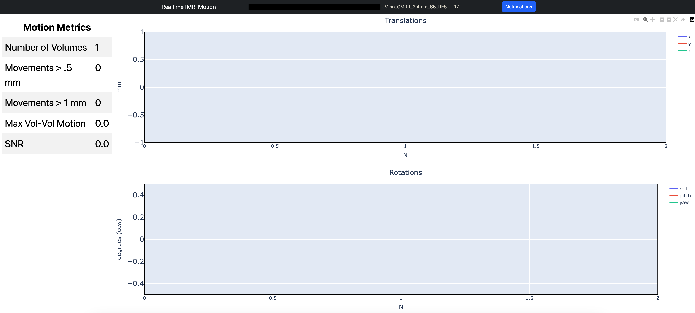

In the Docker log file you should see the Scanbuddy initialization window that looks something like this:

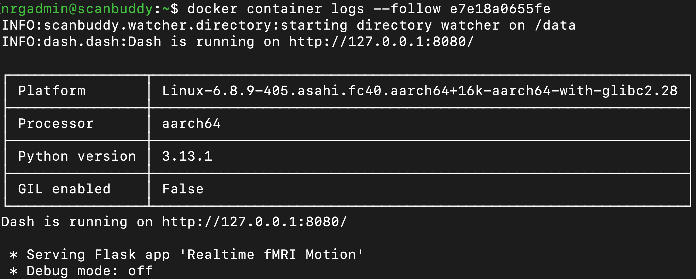

When a BOLD scan starts you will see Scanbuddy start to perform calculations. Here's an example:

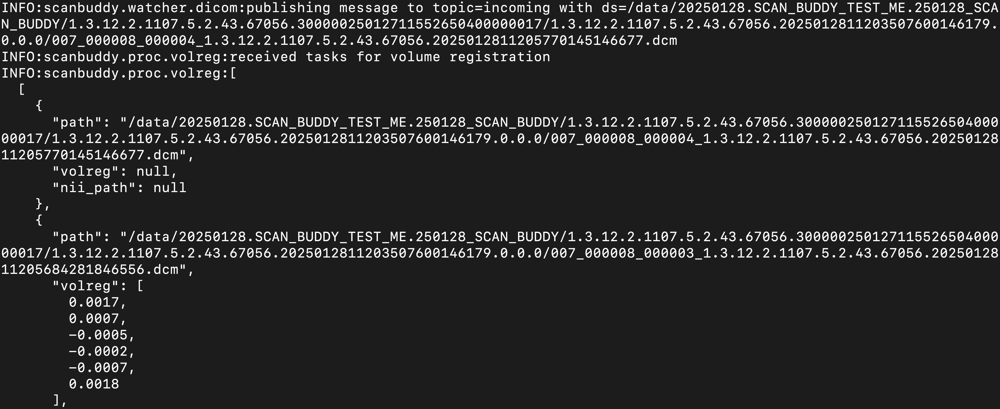

At the conclusion of the scan you will see a motion plot appear on the Scanbuddy display along with a few other helpful metrics. Take a look at this example:

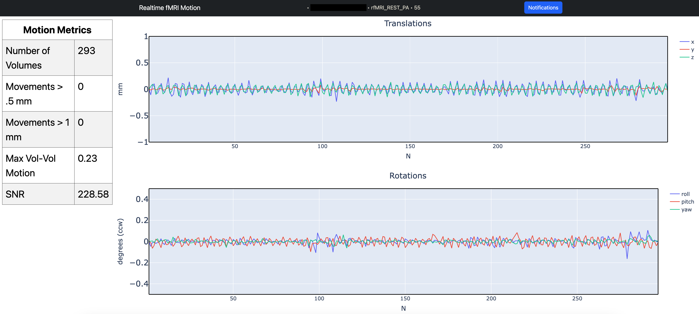

Here's another example with larger motion artifacts:

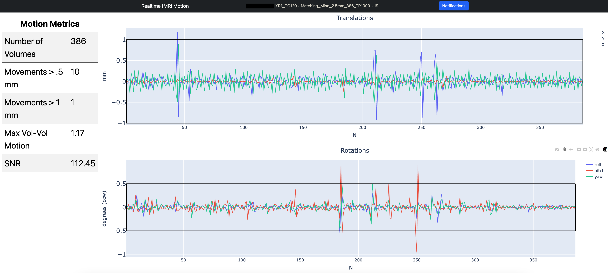

Understanding the Plots and Metrics Table
"""""""""""""""""""""""""""""""""""""""""

The Scanbuddy motion plots show the participant movement over the duration of the scan in 6 different directions: x, y, z, roll, pitch, yaw. They are split into the "Translations" graph for x, y, z and into the "Rotations" graph for roll, pitch, yaw. The "Translations" plot has N on the x-axis meaning number of volumes. The Y-axis is movement in millimeters. The "Rotations" plot also has N on the x-axis for volumes and the y-axis is degrees of rotation. 

The motion shown is volume-to-volume, meaning that the amount of motion shown in volume 150 is relative to where the participant's head was at volume 149. It is not registered to volume one or some other arbitrary volume. See the `technical appendix <technical_appendix.html>`_ section for more details on how the motion calculation happens and specific reasoning for this approach.

The "Motion Metrics" table shows data that may be of interest to users. The table calls users' attention to large motion artifacts with the "Movements > .5 mm" and "Movements > 1 mm" rows. Additionally, Scanbuddy provides a preliminary SNR metric estimation. See the `technical appendix <technical_appendix.html>`_ for details on SNR calculation.

And that's Scanbuddy! Reach out to info@neuroinfo.org with any additional questions or comments. See also: `Scanbuddy github repository <https://github.com/harvard-nrg/scanbuddy>`_

